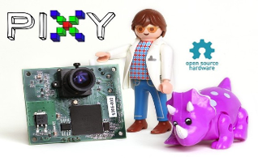
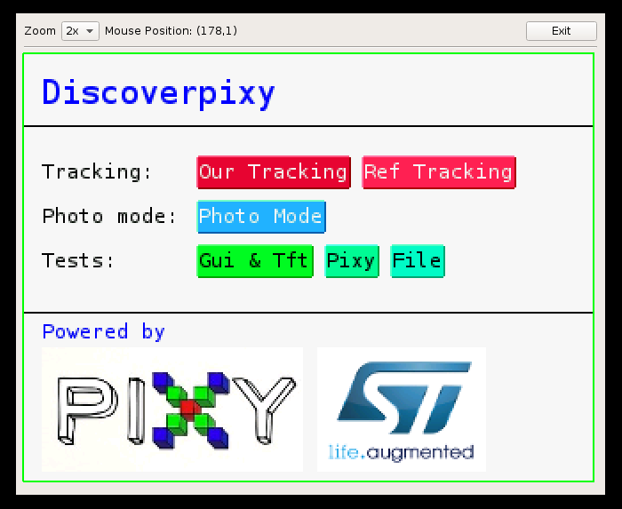
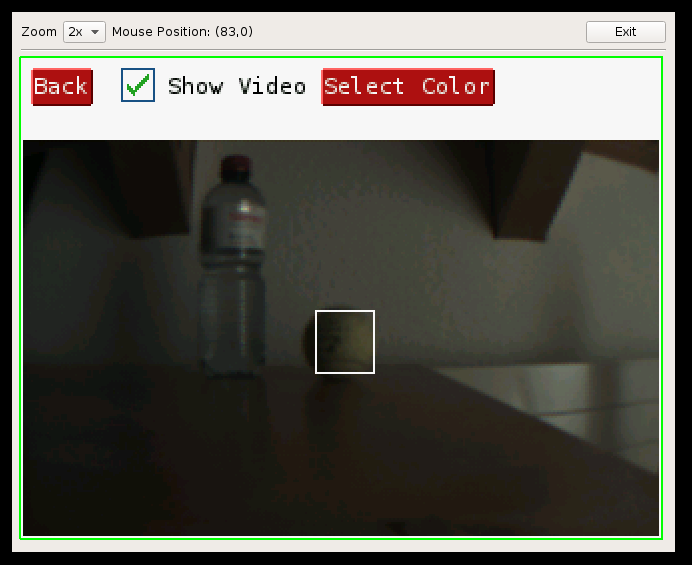

# discoverpixy
A Project with the Pixy cam and the STM32F4 Discovery. The project can also be run on linux/windows using a qt-based emulator.

  

## Documentation
Take a look at our [docu.pdf](./doc/docu.pdf) (German)
Also make sure to check out the [doxygen documentation](http://t-moe.github.io/discoverpixy/) for the common folder.

## Folder structure
* *common*: device independent code and the "Application" itself
* *emulator*: display/touch/sd emulator written in qt. pixy can be connect via usb to computer
* *discovery*: display/touch/sd/pixy can be connected to STM32F4Discovery

All code in the common folder **MUST** be device independent. 

The folder *common/lowlevel* provides the function headers for the device specific code.

## How to build
Go into the *emulator* or the *discovery* folder an use *make*
